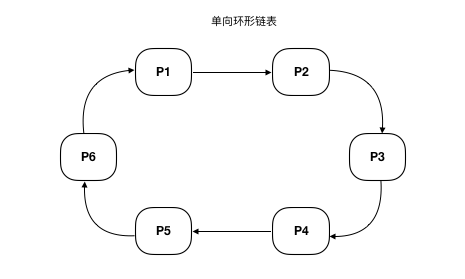
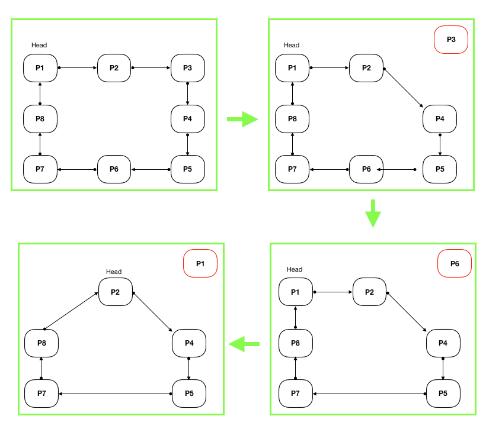

# 单向环形链表 Circle Single LinkedList

> [返回README](../../../../README.md)

单向环形链表:

- 单向环形链表 循环链表是一种链式存储结构，它的最后一个结点指向头结点，形成一个环。因此，从循环链表中的任何一个结点出发都能找到任何其他结点。循环链表的操作和单链表的操作基本一致，差别仅仅在于算法中的循环条件有所不同循环链表是一种链式存储结构，它的最后一个结点指向头结点，形成一个环。因此，从循环链表中的任何一个结点出发都能找到任何其他结点。循环链表的操作和单链表的操作基本一致，差别仅仅在于算法中的循环条件有所不同
- 如下图：

- 循环链表的应用问题

Josephu问题：据说著名犹太历史学家 Josephus有过以下的故事：
在罗马人占领乔塔帕特后，39 个犹太人与Josephus及他的朋友躲到一个洞中，39个犹太人决定宁愿死也不要被敌人找到，
于是决定了一个自杀方式，41个人排成一个圆圈，由第1个人开始报数，每报数到第3人该人就必须自杀，
然后再由下一个重新报数，直到所有人都自杀身亡为止。然而Josephus 和他的朋友并不想遵从，
Josephus要他的朋友先假装遵从，他将朋友与自己安排在第16个与第31个位置，于是逃过了这场死亡游戏。 
如何用循环链表来求解Josephu问题？

