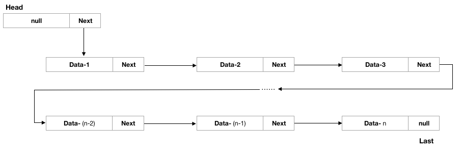

# 单向链表 One-way LinkedList

> [返回README](../../../../README.md)


单向链表:

- 单向链表（又名单链表、线性链表）是链表的一种，其特点是链表的链接方向是单向的，对链表的访问要通过从头部开始，依序往下读取。
- 如下图：


- 初始化

head元素始终为空数据元素，next指向第一个有效元素，为链表的第一个元素。

Last元素，始终指向最后一个元素，初始化的时候指向head。Last是为了让添加的时候不需要进行遍历就可以添加。

- 添加数据

```    
Node temp = new Node(x);
//先把新加的元素添加到最后next中
last.next = temp;
//再把最后一个元素指向添加后的最后一个元素
last = temp;
//有效元素length添加+1
count.getAndIncrement();
```

- 删除数据

```
//trail 为p的上一节点元素，断开连接的时候需要此节点的引用，p为需要判断是否是删除的元素
for (Node<E> trail = head, p = trail.next; p != null; trail = p, p = p.next) {
    if (o.equals(p.data)) {
        unlink(p, trail);
        count.getAndDecrement();
        return true;
    }
}

/**
 * 将内部节点p与上一节点断开连接
 */
void unlink(Node<E> p, Node<E> trail) {
    p.data = null;
    trail.next = p.next;
    //如果最后一个元素被删除，则last需要指向上一节点数据
    if (last == p) {
        last = trail;
    }
}
    
 ```

- 反转链表

```
/**
 * 反转链表
 * - Head->A->B->C-D   ===>>  Head->D->C->B->A
 * - 取出Head的第一个有效元素 cur = head.next
 * - 如果cur不是空元素，则把当前元素的后一个元素所有都给保存起来，next = cur.next
 * - 将当前节点插入到rHead链表中的第一个节点位置， cur.next = rHead.next ; rHead.next = cur;
 * - 让下一次遍历的时候，是取next进行遍历，因为next是当前节点的后一个节点，当前节点已经插入到了rHead中。
 */
public void reverseNode() {
    if (length() <= 1) {
        return;
    }
    //创建一个新队列头
    Node<E> rHead = new Node<>(null);
    //获取第一个数据
    Node<E> cur = head.next;
    //定义一个值来临时保存cur的下一个节点指向
    Node<E> next;
    while (cur != null) {
        //先暂时保存当前节点的下一个节点，因为后面需要使用
        next = cur.next;
        //下面两步是把节点插入到read的第一个H节点位置
        //将cur的下一个节点指向新的链表的最前端
        cur.next = rHead.next;
        //将cur 连接到新的链表上
        rHead.next = cur;
        //让cur后移
        cur = next;
    }
    head.next = rHead.next;
}

```