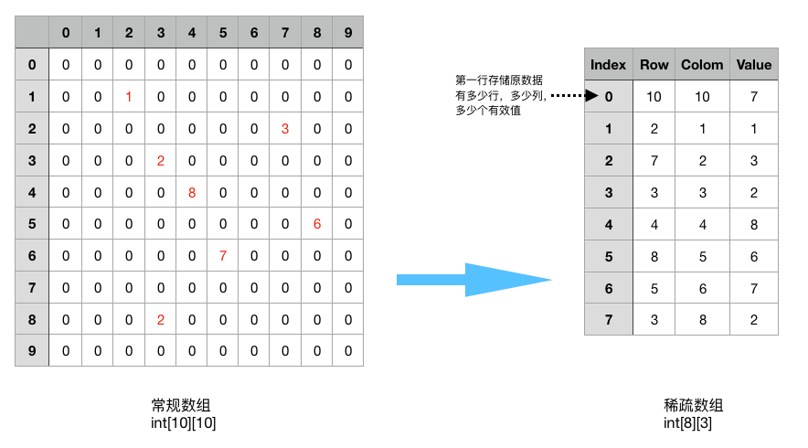

# 稀疏数组 SparseArray

> [返回README](../../../../README.md)

当一个数组中大部分元素为０，或者为同一个值的数组时，可以使用稀疏数组来保存该数组。

稀疏数组:
- 记录数组一共有几行几列，有多少个有效的值（不等于默认值）
- 把有效值的元素的行列及值记录在一个小规模的数组中，从而缩小程序的规模
- 如下图



- 程序输出结果：

```
    原始的二维数组：
    0	0	0	0	0	0	0	0	0	0	
    0	0	0	0	0	0	0	0	0	0	
    0	1	0	0	0	0	0	0	0	0	
    0	0	0	2	0	0	0	0	2	0	
    0	0	0	0	8	0	0	0	0	0	
    0	0	0	0	0	0	7	0	0	0	
    0	0	0	0	0	0	0	0	0	0	
    0	0	3	0	0	0	0	0	0	0	
    0	0	0	0	0	6	0	0	0	0	
    0	0	0	0	0	0	0	0	0	0	
    
    得到稀疏数组为：
    10	10	7	
    2	1	1	
    3	3	2	
    3	8	2	
    4	4	8	
    5	6	7	
    7	2	3	
    8	5	6	
    
    转换后的二维数组：
    0	0	0	0	0	0	0	0	0	0	
    0	0	0	0	0	0	0	0	0	0	
    0	1	0	0	0	0	0	0	0	0	
    0	0	0	2	0	0	0	0	2	0	
    0	0	0	0	8	0	0	0	0	0	
    0	0	0	0	0	0	7	0	0	0	
    0	0	0	0	0	0	0	0	0	0	
    0	0	3	0	0	0	0	0	0	0	
    0	0	0	0	0	6	0	0	0	0	
    0	0	0	0	0	0	0	0	0	0	
```
