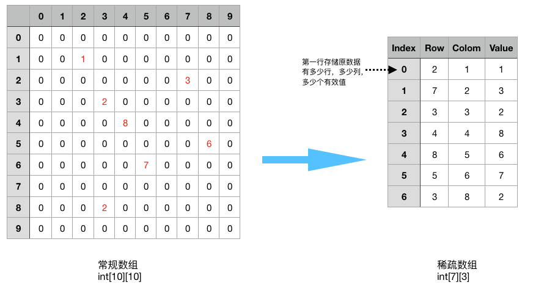

# 稀疏数组 SparseArray

结果

    原始的二维数组：
    0	0	0	0	0	0	0	0	0	0	
    0	0	0	0	0	0	0	0	0	0	
    0	1	0	0	0	0	0	0	0	0	
    0	0	0	2	0	0	0	0	2	0	
    0	0	0	0	8	0	0	0	0	0	
    0	0	0	0	0	0	7	0	0	0	
    0	0	0	0	0	0	0	0	0	0	
    0	0	3	0	0	0	0	0	0	0	
    0	0	0	0	0	6	0	0	0	0	
    0	0	0	0	0	0	0	0	0	0	
    
    得到稀疏数组为：
    10	10	7	
    2	1	1	
    3	3	2	
    3	8	2	
    4	4	8	
    5	6	7	
    7	2	3	
    8	5	6	
    
    转换后的二维数组：
    0	0	0	0	0	0	0	0	0	0	
    0	0	0	0	0	0	0	0	0	0	
    0	1	0	0	0	0	0	0	0	0	
    0	0	0	2	0	0	0	0	2	0	
    0	0	0	0	8	0	0	0	0	0	
    0	0	0	0	0	0	7	0	0	0	
    0	0	0	0	0	0	0	0	0	0	
    0	0	3	0	0	0	0	0	0	0	
    0	0	0	0	0	6	0	0	0	0	
    0	0	0	0	0	0	0	0	0	0	
